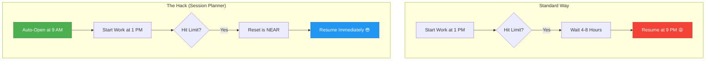

# 🕐 SessionPlanner

[](https://github.com/MahmoudMabrok/SessionPlanner/actions)
[](https://www.npmjs.com/package/session-planner)

> Schedule "Hello!" Claude Code sessions at times you choose — opening Claude **N hours before** each target time. Works as a terminal CLI, an `npx` one-liner, or a Claude Code plugin.

---

## 💡 Motivation

This tool helps maximize your Claude Code session duration by opening sessions ahead of time. Starting a session earlier ensures that if you hit a usage limit, the next reset time is already much closer (or has already passed), effectively eliminating idle waiting time.

### The "Session Hack" Explained




---

## Quick start — terminal / npx (no install needed)

```bash
npx session-planner hello 1am
npx session-planner hello 9am 2pm 6pm
npx session-planner hello 14:00 --offset 2h
npx session-planner list
npx session-planner remove 2pm
npx session-planner remove --all
npx session-planner help
```

---

## Install globally (optional)

```bash
npm install -g session-planner
session-planner hello 1am
```

---

## Install as a Claude Code plugin

```
/plugin marketplace add MahmoudMabrok/SessionPlanner
/plugin install session-planner@mahmoudmabrok-sessionplanner
/reload-plugins
```

Then inside Claude Code:

```
/session-planner:hello 1am
/session-planner:hello 9am 2pm --offset 2h
/session-planner:hello-list
/session-planner:hello-remove 2pm
```

---

## How it works

```
npx session-planner hello 1am
        │
        ▼
bin/session-planner.js   (Node.js CLI)
        │
        ▼
scripts/hello-scheduler.sh   (bash)
        │
        ├── Target:   1:00 am
        ├── Offset:   4h (default)
        ├── Session:  9:00 pm  ← cron fires claude here
        │
        └── 0 21 * * *  claude --print "Hello! It is now 1:00 am..."
```

| Layer | What | Persists after terminal close? |
|---|---|---|
| `cron` | `claude --print` at session time | ✅ Yes |
| `/loop` | In-session reminder (Claude Code only) | ❌ Session-bound |

---

## Time formats

| Input | Means |
|---|---|
| `1am` | 1:00 AM |
| `12am` | Midnight |
| `12pm` | Noon |
| `2:30pm` | 2:30 PM |
| `14:30` | 2:30 PM |

---

## Options

| Flag | Default | Description |
|---|---|---|
| `--offset Nh` | `4h` | Open session N hours before target |

---

## Requirements

| | Notes |
|---|---|
| **Node.js** ≥ 14 | For npx / global install |
| **Claude Code** | `claude` in PATH — [install](https://code.claude.com) |
| **cron** | Built-in on macOS; Linux: `sudo apt install cron` |
| **Bash** 4+ | macOS: `brew install bash` |

Logs: `~/.claude/session-planner.log`

---

## Repo structure

```
SessionPlanner/
├── .claude-plugin/plugin.json     ← Claude Code plugin manifest
├── bin/session-planner.js         ← npx / global CLI entry
├── commands/{hello,hello-list,hello-remove}.md
├── skills/hello-scheduler/SKILL.md
├── scripts/hello-scheduler.sh     ← core scheduling logic
├── tests/test-parse.sh            ← 18 unit tests
├── package.json
└── .github/workflows/ci.yml
```

---

## Publish to npm

```bash
npm login
npm publish
# users then run: npx session-planner hello 1am
```

---

## License

MIT
